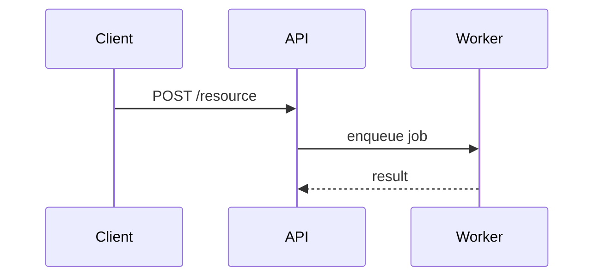

# Writing `## What`

Examples of each view referenced from SKILL.md.

## Pseudocode

Show logic or an algorithm:

```text
on(save)
  if content is unchanged
    return cached result
  write new content
  return fresh result
```

## Call tree

Show runtime control flow:

```text
submitForm
  createSession
    persistPrompt
    launchAgent
  navigateToSession
```

## File tree

Show file responsibility or a broad refactor:

```text
src/
├── commands/       # parses user actions
├── sessions/       # owns session state
└── transport/      # sends API requests
```

## Mermaid

Show component interaction, control flow, or data flow:



## Diff

Use when the point is *what changes* and the surrounding shape already exists. Match the diff shape to the
topic — a file-layout diff, a call-tree diff, or a control-flow diff:

```diff
 submitForm
   createSession
     persistPrompt
+    validateQuota
     launchAgent
-  navigateToSession
+  navigateToSession
+    trackAnalyticsEvent
```

```diff
 on(save)
-  write content
+  if content is unchanged
+    return cached result
+  write new content
+  invalidate cache
```

Show the whole block instead of a diff when most of it is new, when omitted context would hide ownership or
order, or when the reviewer needs a copyable target shape.
